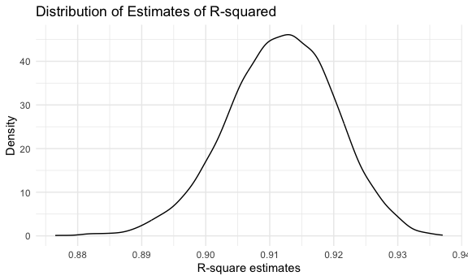

p8105_hw6_cr3442
================
Cheng Rao
2024-12-02

# Problem 1

First import the data.  

  
Then take a look of the regression.  

``` r
weather_df %>%
  ggplot(aes(x = tmin, y = tmax)) +
  geom_point(alpha = .3) +
  geom_smooth(method = "lm",se = F)
```

    ## `geom_smooth()` using formula = 'y ~ x'

  

Let’s bootstraping.  

``` r
weather_boot = 
  weather_df %>% 
  bootstrap(n = 5000) %>%
  mutate(
    models = map(strap, ~lm(tmax ~ tmin, data = .x)),
    results = map(models, broom::tidy),
    glanced = map(models, broom::glance)
    ) %>% 
  select(-strap, -models) %>% 
  unnest(c(results, glanced), names_repair = "unique") %>% 
  select(.id, term, estimate, r.squared) %>% 
  mutate(
    term = str_replace(term, "\\(Intercept\\)", "intercept")
  ) %>% 
  pivot_wider(
    names_from = term,
    values_from = estimate
  ) %>% 
  mutate(
    intersection = log(intercept * tmin),
    .id = as.numeric(.id)
  ) %>% 
  select(-intercept, -tmin)
```

    ## New names:
    ## • `statistic` -> `statistic...5`
    ## • `p.value` -> `p.value...6`
    ## • `statistic` -> `statistic...10`
    ## • `p.value` -> `p.value...11`

Let’s plot the distribution of r square.  

``` r
weather_boot %>% 
  ggplot(aes(x = r.squared)) +
  geom_density() +
  labs(
    title = "Distribution of Estimates of R-squared",
    x = "R-square estimates",
    y = "Density"
  ) +
  scale_x_continuous(
    breaks = seq(.85,.95,.01)
  )
```

  
Let’s plot the distribution of intersection, while intersection = log(β0
\* β1).  

``` r
weather_boot %>% 
  ggplot(aes(x = intersection)) +
  geom_density() +
  labs(
    title = "Distribution of Estimates of Coefficients Intersections",
    x = "Coefficients Estimates Intersection",
    y = "Density"
  ) +
  scale_x_continuous(
    breaks = seq(1.90, 2.15, .02)
  )
```

  
Finally, lets calculate and report the 95% confidence interval.  

``` r
ci_r_squared = quantile(weather_boot$r.squared, c(0.025, 0.975))
ci_intersection = quantile(weather_boot$intersection, c(0.025, 0.975))

ci_r_squared
```

    ##  2.5% 97.5% 
    ## 0.894 0.927

``` r
ci_intersection
```

    ##  2.5% 97.5% 
    ##  1.96  2.06

**Comments:**  
The distribution of estimated r-squared is approximately normal. With
the mean 0.912 and median 0.912. And the standard error of this
distribution is 0.008. Ranging from 0.876 to 0.937.  
  
The distribution of the natural log of the intersection of estimated
coefficients is approximately normal. With the mean 2.013 and median
2.013. And the standard error of this distribution is 0.024. Ranging
from 1.913 to 2.097.  
  
With 95% confidence, the r-squared value, which measures the goodness of
fit of the regression model, lies between 0.894 and 0.927. With 95%
confidence, the value of log(β0 \* β1), which reflects the logarithm of
the product of the intercept and slope coefficients, lies between 1.96
and 2.06.

# Problem 2

First import the data and clean it up.  

``` r
homicide_df = 
  read_csv("data/homicide-data.csv", na = c("","NA","Unknown")) %>% 
  mutate(
    city_state = str_c(city, state, sep = ", "),
    victim_age = as.numeric(victim_age),
    resolved = case_when(
      disposition == "Closed without arrest" ~ 0,
      disposition == "Open/No arrest"        ~ 0,
      disposition == "Closed by arrest"      ~ 1
    )
  ) %>% 
  select(city_state, victim_age, victim_race, victim_sex,resolved) %>% 
filter(
  victim_race %in% c("White", "Black"),
  city_state != "Dallas, TX" & 
  city_state != "Phoenix, AZ" & 
  city_state != "Kansas City, MO" & 
  city_state != "Tulsa, AL"
)
```

    ## Rows: 52179 Columns: 12
    ## ── Column specification ────────────────────────────────────────────────────────
    ## Delimiter: ","
    ## chr (8): uid, victim_last, victim_first, victim_race, victim_sex, city, stat...
    ## dbl (4): reported_date, victim_age, lat, lon
    ## 
    ## ℹ Use `spec()` to retrieve the full column specification for this data.
    ## ℹ Specify the column types or set `show_col_types = FALSE` to quiet this message.

  
Start with one sample city, Baltimore.  

``` r
baltimore_df = 
  homicide_df %>% 
  filter(city_state == "Baltimore, MD")

glm(resolved ~ victim_age + victim_race + victim_sex,
    data = baltimore_df,
    family = binomial()) %>% 
  broom::tidy() %>% 
  mutate(
    OR = exp(estimate),
    CI_lower = exp(estimate - 1.96 * std.error),
    CI_upper = exp(estimate + 1.96 * std.error)
  ) %>% 
  select(term, OR, starts_with("CI")) %>% 
  knitr::kable(digits = 3)
```

| term             |    OR | CI_lower | CI_upper |
|:-----------------|------:|---------:|---------:|
| (Intercept)      | 1.363 |    0.975 |    1.907 |
| victim_age       | 0.993 |    0.987 |    1.000 |
| victim_raceWhite | 2.320 |    1.648 |    3.268 |
| victim_sexMale   | 0.426 |    0.325 |    0.558 |

  
Then perform batch analysis for each city.  

``` r
models_results_df = 
  homicide_df %>% 
  nest(data = -city_state) %>% 
  mutate(
    models = 
      map(.x = data, ~glm(resolved ~ victim_age + victim_race + victim_sex, data = .x,family = binomial())),
    results = map(models, broom::tidy)
  ) %>% 
  select(city_state, results) %>% 
  unnest(results) %>% 
  mutate(
    OR = exp(estimate),
    CI_lower = exp(estimate - 1.96 * std.error),
    CI_upper = exp(estimate + 1.96 * std.error)
  ) %>% 
  select(city_state,term,OR,starts_with("CI"))
```

  
Finally, plot the OR and CI of each city.  

``` r
models_results_df %>% 
  filter(term == "victim_sexMale") %>%      
  mutate(
    city_state = fct_reorder(city_state, OR)   
  ) %>% 
  ggplot(aes(x = city_state, y = OR)) +
  geom_errorbar(aes(ymin = CI_lower, ymax = CI_upper), width = 0.2) + 
  geom_point() +                                                     
  geom_hline(yintercept = 1, linetype = "dashed", color = "red") +     
  theme_minimal() +                                                   
  theme(
    axis.text.x = element_text(angle = 90, hjust = 1),                 
    plot.title = element_text(size = 14, face = "bold"),              
    plot.subtitle = element_text(size = 10)                          
  ) +
  labs(
    x = "City, State",                                                
    y = "Adjusted Odds Ratio (OR)",                                    
    title = "Adjusted Odds Ratios (Male vs Female) by City",          
    subtitle = "Error bars represent 95% confidence intervals",        
    caption = "Data Source: The Washington Post Homicide Dataset"     
  )
```


**Comments:**  
The red dashed line (OR = 1) is the reference line, indicating that male
and female victims are equally likely to have their cases resolved. Most
cities have confidence intervals that include OR = 1, indicating that
gender differences in these cities are not statistically significant.  
However, the adjusted odds ratios (ORs) for different cities range
widely, from close to 0 to over 3, showing significant differences in
gender differences between cities. In cities where the OR is
significantly lower than 1 (such as some cities on the far left, such as
New York, NY), it indicates that female victims have a higher likelihood
of having their cases resolved. In cities where the OR is significantly
higher than 1 (such as Albuquerque, NM and Stockton, CA on the far
right), male victims have a higher likelihood of having their cases
resolved. However, in some cities, the confidence intervals are wide,
which may reflect insufficient sample size or unstable data.  
But overall, male victims are slightly less likely to have their cases
resolved than female victims.
